# **Laporan Praktikum Sistem Operasi 2026 - Modul 3**

**Nama:** Rido Patra Yudhistira Edwin  
**NRP:** 5027251120  
**Kelas:** B  
**Repositori:** SISOP-3-2026-IT-120

-----

## **Langkah Pengerjaan**

### **Inisialisasi & Persiapan Direktori**

```bash
# Masuk ke direktori praktikum

# Clone repositori yang sudah ada
git clone git@github.com:Bl4nk06/SISOP-2-2026-IT-120.git
cd SISOP-2-2026-IT-120

# Membuat struktur folder soal
mkdir soal_1 soal_2 soal_3
```

---

### **Struktur Direktori:**

```bash
.
├── soal1
│   ├── history.log
│   ├── navi.c
│   ├── protocol.c
│   ├── protocol.h
│   └── wired.c
└── soal2
    ├── Makefile
    ├── arena.h
    ├── eternal.c
    └── orion.c
```

---

## **Penyelesaian Soal 1**

### **Soal 1: The Wired (Socket Programming)**
*Tujuan: Membangun fondasi komunikasi jaringan menggunakan arsitektur Client-Server.*

*   **1: Koneksi Stabil** – Membuat server yang selalu siap menerima koneksi pada alamat dan port tertentu tanpa mengganggu pengguna lain yang sudah terhubung.
*   **2: Unit NAVI Asinkron** – Mengimplementasikan *multi-threading* pada client agar bisa menerima pesan (mendengarkan) dan mengirim input pengguna secara bersamaan tanpa saling menunggu (*non-blocking*).
*   **3: Skalabilitas Server** – Memastikan server bisa menangani banyak klien sekaligus, memproses permintaan login/chat secara efisien, dan menangani pemutusan koneksi secara bersih (`/exit` atau signal interrupt).
*   **4: Identitas Digital Unik** – Menerapkan validasi identitas (nama) di sisi server; jika ada nama yang sama mencoba masuk, koneksi harus ditolak.
*   **5: Mekanisme Broadcast** – Mengembangkan sistem distribusi pesan di mana setiap pesan yang masuk ke server diteruskan ke seluruh klien yang sedang aktif.
*   **6: Remote Procedure Call (The Knights)** – Membuat jalur khusus admin (autentikasi password) untuk meminta data internal seperti jumlah user aktif, *uptime* server, atau mematikan server secara remote.
*   **7: Centralized Logging** – Mencatat setiap aktivitas (Chat/Admin/System) ke dalam file `history.log` lengkap dengan stempel waktu dalam format yang ditentukan.

---

### **Langkah Teknis**

```bash
# Pindah directory
cd soal1

# Membuat file header dan source code
touch protocol.h protocol.c wired.c navi.c

# Mengedit file
nano protocol.h

nano protocol.c

nano wired.c

nano navi.c
```

---

### **Kode yang Digunakan**

#### **Kode yang digunakan dalam file protocol.h**

```c
#ifndef PROTOCOL_H
#define PROTOCOL_H

#include <stdio.h>
#include <stdlib.h>
#include <string.h>
#include <unistd.h>
#include <arpa/inet.h>
#include <pthread.h>
#include <time.h>
#include <signal.h>

#define PORT 8080
#define BUFFER_SIZE 1024
#define MAX_CLIENTS 50

typedef enum {
    MSG_LOGIN,
    MSG_CHAT,
    MSG_ERROR,
    MSG_SUCCESS,
    MSG_ADMIN,
    MSG_SHUTDOWN
} msg_type_t;

typedef struct {
    msg_type_t type;
    char username[32];
    char text[BUFFER_SIZE];
} payload_t;

void get_timestamp(char *buffer);
void log_message(const char *role, const char *status, const char *msg);

#endif
```

#### **Kode yang digunakan dalam file protocol.c**

```c
#include "protocol.h"

void get_timestamp(char *buffer) {
    time_t now = time(NULL);
    struct tm *t = localtime(&now);
    strftime(buffer, 20, "%Y-%m-%d %H:%M:%S", t);
}

void log_message(const char *role, const char *status, const char *msg) {
    FILE *log_file = fopen("history.log", "a");
    if (!log_file) return;

    char ts[20];
    get_timestamp(ts);
    fprintf(log_file, "[%s] [%s] [%s] %s\n", ts, role, status, msg);
    fclose(log_file);
}
```

#### **Kode yang digunakan dalam file wired.c**

```c
#include "protocol.h"

int client_sockets[MAX_CLIENTS];
char client_names[MAX_CLIENTS][32];
pthread_mutex_t clients_mutex = PTHREAD_MUTEX_INITIALIZER;
time_t start_time;

void broadcast(payload_t *p, int sender_fd) {
    pthread_mutex_lock(&clients_mutex);
    for (int i = 0; i < MAX_CLIENTS; i++) {
        if (client_sockets[i] != -1 && client_sockets[i] != sender_fd) {
            send(client_sockets[i], p, sizeof(payload_t), 0);
        }
    }
    pthread_mutex_unlock(&clients_mutex);
}

void *handle_client(void *arg) {
    int fd = *((int *)arg);
    free(arg);
    payload_t p;
    char name[32] = "";

    // Step 1: Authentication / Login
    if (recv(fd, &p, sizeof(payload_t), 0) <= 0) { close(fd); return NULL; }
    
    pthread_mutex_lock(&clients_mutex);
    int exists = 0;
    for (int i = 0; i < MAX_CLIENTS; i++) {
        if (client_sockets[i] != -1 && strcmp(client_names[i], p.username) == 0) {
            exists = 1; break;
        }
    }

    if (exists && strcmp(p.username, "The Knights") != 0) {
        p.type = MSG_ERROR;
        send(fd, &p, sizeof(payload_t), 0);
        pthread_mutex_unlock(&clients_mutex);
        close(fd); return NULL;
    }

    // Assign to slot
    int slot = -1;
    for (int i = 0; i < MAX_CLIENTS; i++) {
        if (client_sockets[i] == -1) {
            client_sockets[i] = fd;
            strcpy(client_names[i], p.username);
            strcpy(name, p.username);
            slot = i; break;
        }
    }
    pthread_mutex_unlock(&clients_mutex);

    p.type = MSG_SUCCESS;
    send(fd, &p, sizeof(payload_t), 0);
    
    char log_buf[256];
    sprintf(log_buf, "User '%s' connected", name);
    log_message("System", "Status", log_buf);

    // Step 2: Main Loop
    while (recv(fd, &p, sizeof(payload_t), 0) > 0) {
        if (p.type == MSG_ADMIN) {
            if (strcmp(p.text, "RPC_GET_USERS") == 0) {
                int count = 0;
                pthread_mutex_lock(&clients_mutex);
                for(int i=0; i<MAX_CLIENTS; i++) if(client_sockets[i] != -1 && strcmp(client_names[i], "The Knights") != 0) count++;
                pthread_mutex_unlock(&clients_mutex);
                sprintf(p.text, "Active Entities: %d", count);
                send(fd, &p, sizeof(payload_t), 0);
                log_message("Admin", "RPC_GET_USERS", "");
            } else if (strcmp(p.text, "RPC_SHUTDOWN") == 0) {
                log_message("Admin", "RPC_SHUTDOWN", "EMERGENCY SHUTDOWN INITIATED");
                exit(0);
            }
        } else {
            char chat_log[BUFFER_SIZE + 50];
            sprintf(chat_log, "[%s]: %s", name, p.text);
            log_message("User", chat_log, "");
            broadcast(&p, fd);
        }
    }

    // Cleanup on disconnect
    pthread_mutex_lock(&clients_mutex);
    client_sockets[slot] = -1;
    pthread_mutex_unlock(&clients_mutex);
    sprintf(log_buf, "User '%s' disconnected", name);
    log_message("System", "Status", log_buf);
    close(fd);
    return NULL;
}

int main() {
    int server_fd;
    struct sockaddr_in address;
    start_time = time(NULL);

    for (int i = 0; i < MAX_CLIENTS; i++) client_sockets[i] = -1;

    server_fd = socket(AF_INET, SOCK_STREAM, 0);
    int opt = 1;
    setsockopt(server_fd, SOL_SOCKET, SO_REUSEADDR, &opt, sizeof(opt));

    address.sin_family = AF_INET;
    address.sin_addr.s_addr = INADDR_ANY;
    address.sin_port = htons(PORT);

    bind(server_fd, (struct sockaddr *)&address, sizeof(address));
    listen(server_fd, 10);
    
    log_message("System", "SERVER ONLINE", "");
    printf("The Wired is active on port %d...\n", PORT);

    while (1) {
        int *new_sock = malloc(sizeof(int));
        *new_sock = accept(server_fd, NULL, NULL);
        pthread_t tid;
        pthread_create(&tid, NULL, handle_client, new_sock);
        pthread_detach(tid);
    }
    return 0;
}
```

#### **Kode yang digunakan dalam file navi.c**

```c
#include "protocol.h"

int sock_fd;
char my_username[32];

void *receive_handler(void *arg) {
    payload_t p;
    while (recv(sock_fd, &p, sizeof(payload_t), 0) > 0) {
        if (p.type == MSG_ERROR) {
            printf("\n[System] Identity already synchronized in The Wired.\n");
            exit(0);
        } else if (p.type == MSG_CHAT) {
            printf("\n[%s]: %s\n> ", p.username, p.text);
            fflush(stdout);
        } else if (p.type == MSG_ADMIN) {
            printf("\n[Admin Response]: %s\n> ", p.text);
            fflush(stdout);
        }
    }
    return NULL;
}

int main() {
    struct sockaddr_in serv_addr;
    sock_fd = socket(AF_INET, SOCK_STREAM, 0);

    serv_addr.sin_family = AF_INET;
    serv_addr.sin_port = htons(PORT);
    inet_pton(AF_INET, "127.0.0.1", &serv_addr.sin_addr);

    if (connect(sock_fd, (struct sockaddr *)&serv_addr, sizeof(serv_addr)) < 0) {
        printf("Connection Failed. The Wired is offline.\n");
        return -1;
    }

    printf("Enter your name: ");
    fgets(my_username, 32, stdin);
    my_username[strcspn(my_username, "\n")] = 0;

    payload_t p;
    p.type = MSG_LOGIN;
    strcpy(p.username, my_username);
    send(sock_fd, &p, sizeof(payload_t), 0);

    // Initial Auth Check
    recv(sock_fd, &p, sizeof(payload_t), 0);
    if (p.type == MSG_ERROR) {
        printf("[System] The identity '%s' is already synchronized in The Wired.\n", my_username);
        return 0;
    }

    printf("--- Welcome to The Wired, %s ---\n", my_username);
    
    if (strcmp(my_username, "The Knights") == 0) {
        printf("Enter Password: ");
        char pwd[32];
        fgets(pwd, 32, stdin);
        pwd[strcspn(pwd, "\n")] = 0;
        if (strcmp(pwd, "protocol7") != 0) { printf("Access Denied.\n"); return 0; }
        printf("[System] Authentication Successful. Granted Admin privileges.\n");
    }

    pthread_t tid;
    pthread_create(&tid, NULL, receive_handler, NULL);

    while (1) {
        printf("> ");
        fgets(p.text, BUFFER_SIZE, stdin);
        p.text[strcspn(p.text, "\n")] = 0;

        if (strcmp(p.text, "/exit") == 0) {
            printf("[System] Disconnecting from The Wired...\n");
            break;
        }

        if (strcmp(my_username, "The Knights") == 0) {
            p.type = MSG_ADMIN;
            if (strcmp(p.text, "1") == 0) strcpy(p.text, "RPC_GET_USERS");
            else if (strcmp(p.text, "3") == 0) strcpy(p.text, "RPC_SHUTDOWN");
        } else {
            p.type = MSG_CHAT;
        }
        
        strcpy(p.username, my_username);
        send(sock_fd, &p, sizeof(payload_t), 0);
    }

    close(sock_fd);
    return 0;
}
```

---

### **Penjelasan**

### **1. Koneksi Stabil**
Server dirancang untuk selalu siap menerima koneksi pada alamat dan port yang telah ditentukan dalam `protocol.h` (Port 8080). Penggunaan fungsi `listen` dan `accept` di dalam loop `while(1)` pada `wired.c` memastikan server terus berjalan tanpa henti. Fitur `SO_REUSEADDR` digunakan agar server bisa segera dijalankan kembali meskipun baru saja dimatikan tanpa harus menunggu *timeout* port dari OS, sehingga stabilitas layanan tetap terjaga bagi pengguna lain.

### **2. Unit NAVI Asinkron**
Pada `navi.c`, aplikasi klien mengimplementasikan *multi-threading* untuk menjalankan fungsi secara asinkron. 
*   **Mendengarkan Transmisi:** Fungsi `receive_handler` dijalankan dalam thread terpisah (`pthread_create`) untuk terus menerima pesan dari server tanpa berhenti.
*   **Mengirim Input:** Loop utama `while(1)` di fungsi `main` tetap bisa mengambil input dari pengguna (`fgets`) secara bersamaan tanpa terhalang oleh proses penerimaan data.

### **3. Skalabilitas Server**
Server (`wired.c`) menggunakan model **One-Thread-per-Client**. Setiap kali koneksi baru diterima melalui `accept`, server membuat thread baru menggunakan `pthread_create` untuk menjalankan fungsi `handle_client`. Hal ini memungkinkan server menangani banyak klien sekaligus secara paralel. Pemutusan koneksi ditangani secara bersih di dalam `handle_client` yang mendeteksi akhir transmisi, menutup socket, dan mengosongkan slot klien di memori.

### **4. Identitas Digital Unik**
Validasi identitas dilakukan di sisi server pada bagian awal fungsi `handle_client`. Saat klien mengirimkan paket `MSG_LOGIN`, server memindai array `client_names` untuk mengecek apakah nama tersebut sudah digunakan oleh klien lain yang aktif. Jika ditemukan duplikasi (dan bukan admin "The Knights"), server mengirimkan `MSG_ERROR` dan langsung memutuskan koneksi klien tersebut.

### **5. Mekanisme Broadcast**
Distribusi informasi kolektif diimplementasikan melalui fungsi `broadcast` pada `wired.c`. Setiap kali server menerima pesan bertipe `MSG_CHAT` dari salah satu klien, server akan melakukan loop terhadap seluruh array `client_sockets` dan mengirimkan pesan tersebut ke semua klien lain yang sedang aktif, kecuali kepada pengirim aslinya.

### **6. Remote Procedure Call (The Knights)**
Fungsi khusus untuk entitas pengelola diimplementasikan melalui pemeriksaan nama pengguna "The Knights".
*   **Autentikasi:** Klien NAVI akan meminta password ("protocol7") jika pengguna masuk dengan nama tersebut.
*   **Prosedur Jarak Jauh:** Di sisi server, jika pesan bertipe `MSG_ADMIN` diterima, server akan menjalankan logika spesifik:
    *   **RPC_GET_USERS:** Menghitung jumlah entitas aktif selain admin.
    *   **RPC_SHUTDOWN:** Mematikan server pusat melalui perintah `exit(0)` setelah mencatat log darurat.

### **7. Centralized Logging**
Seluruh aktivitas di The Wired dicatat secara permanen menggunakan fungsi di `protocol.c`.
*   **Format Log:** Fungsi `log_message` membuka file `history.log` dan menuliskan data dengan format: `[Timestamp] [Role] [Status/Command/Chat] [Pesan]`.
*   **Stempel Waktu:** Fungsi `get_timestamp` menghasilkan waktu saat ini dengan format `YYYY-MM-DD HH:MM:SS`. 
Aktivitas yang dicatat meliputi server online, koneksi/diskoneksi pengguna, pesan obrolan, serta eksekusi perintah admin.

---

### **Cara Menggunakan**

#### **1. Compile** 
Buka terminal di folder Soal 1, lalu jalankan perintah berikut untuk membangun *binary* server dan client:

```bash
# Kompilasi Server (The Wired)
gcc wired_2.c protocol_2.c -o wired -lpthread

# Kompilasi Client (NAVI)
gcc navi_2.c protocol_2.c -o navi -lpthread
```

#### **2. Menjalankan Service (Step by Step)**

##### **A. Mengaktifkan Server (Poin 1 & 3)**

Jalankan server terlebih dahulu. Ini akan membuka port 8080 dan mulai mencatat aktivitas ke `history.log`.
```bash
./wired
```
*   **Verifikasi Poin 1:** Server akan mencetak `The Wired is active on port 8080...`.
*   **Verifikasi Poin 7:** Cek file log dengan `cat history.log`. Akan muncul baris `[SERVER ONLINE]`.

##### **B. Menghubungkan Client (Poin 2 & 4)**
Buka **terminal baru**, lalu jalankan client NAVI:
```bash
./navi
```
*   **Langkah:** Masukkan nama (misal: `Lain`).
*   **Verifikasi Poin 4:** Jika membuka terminal lain dan mencoba masuk dengan nama `Lain` lagi, server akan menolak dengan pesan `Identity already synchronized`.
*   **Verifikasi Poin 2:** Bisa mengetik pesan sambil tetap menerima pesan dari orang lain secara *real-time* tanpa gangguan.

##### **C. Mekanisme Chat & Broadcast (Poin 5)**
Buka minimal dua terminal client.
1.  Ketik pesan di Client A.
2.  **Verifikasi Poin 5:** Client B akan otomatis menerima pesan tersebut dalam format `[Nama]: Pesan`.

##### **D. Fitur Admin The Knights (Poin 6)**
Jalankan client baru, lalu masukkan nama khusus:
*   **Nama:** `The Knights`
*   **Password:** `protocol7`

**Perintah Admin (Remote Procedure Call):**
*   Ketik `1` untuk menjalankan `RPC_GET_USERS`. Server akan membalas jumlah NAVI aktif (tidak menghitung admin).
*   Ketik `3` untuk menjalankan `RPC_SHUTDOWN`. Server pusat akan mati seketika.

##### **E. Mengakhiri Sesi (Poin 3)**
Pada terminal client mana pun, ketik perintah berikut untuk keluar secara bersih:
```bash
/exit
```
*   **Verifikasi Poin 3:** Server akan mencatat log `User disconnected` dan membebaskan slot memori tanpa *crash*.

#### **3. Pemeriksaan Log (Poin 7)**
Selama semua proses di atas berjalan, bisa pantau file `history.log` secara *real-time* untuk kebutuhan laporan.

```bash
# Melihat seluruh riwayat aktivitas
cat history.log

# Format log yang akan terlihat:
# [2026-05-03 20:45:01] [System] [SERVER ONLINE] 
# [2026-05-03 20:45:10] [System] [Status] User 'Lain' connected
# [2026-05-03 20:45:15] [User] [[Lain]: Halo Wired] [] 
# [2026-05-03 20:45:20] [Admin] [RPC_GET_USERS] []
```

---

### **Output**

#### **1. Aktivitas Server & Inisialisasi (Poin 1 & 7)**
*   **Screenshot Terminal Server:** Menampilkan saat `./wired` pertama kali dijalankan dan muncul pesan `The Wired is active on port 8080...`.

	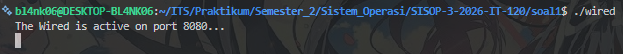

*   **Screenshot Isi Log Awal:** Buka file `history.log` dan tunjukkan baris pertama yang berisi `[System] [SERVER ONLINE]` lengkap dengan *timestamp*.

	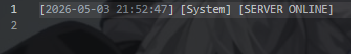


#### **2. Registrasi & Validasi Identitas (Poin 4)**
*   **Screenshot Login Berhasil:** Menampilkan Terminal NAVI saat memasukkan nama (misal: `Lain`) dan muncul pesan selamat datang.

	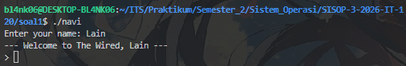

*   **Screenshot Error Duplikasi Nama:** Buka dua terminal NAVI, masukkan nama yang sama pada keduanya. Tunjukkan terminal kedua yang menampilkan pesan `Identity already synchronized` atau `Error` lalu keluar otomatis.

	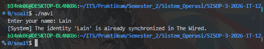

#### **3. Komunikasi Asinkron & Broadcast (Poin 2 & 5)**
*   **Screenshot Multi-Client Chat:** Tampilkan minimal **dua jendela terminal** secara berdampingan (2 Client).

	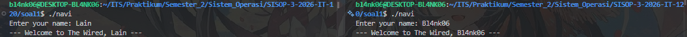

*   **Aksi:** Ketik pesan di Client A, lalu SS bagian pesan tersebut muncul secara *real-time* di Client B. Ini membuktikan fitur *broadcast* dan *multi-threading* berjalan.

	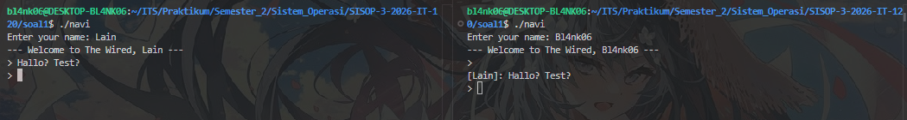

#### **4. Fitur Pengelola / Admin (Poin 6 - Revisi)**
*   **Screenshot Login Admin:** Menampilkan input nama `The Knights` dan proses memasukkan password `protocol7`.

	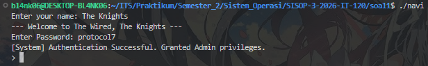

*   **Screenshot RPC Get Users:** Tunjukkan terminal Admin menerima info jumlah user yang sedang aktif.

	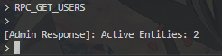

#### **5. Terminasi & Logging Permanen (Poin 3, 6, & 7)**
*   **Screenshot Emergency Shutdown:** Tunjukkan terminal Admin mengetik `RPC_SHUTDOWN` dan terminal Server yang otomatis tertutup/exit.

	

	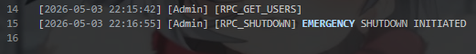

*   **Screenshot Log Akhir (History):** Tampilkan isi file `history.log` yang sudah penuh dengan catatan aktivitas dari awal sampai akhir, termasuk log `[Admin] [RPC_SHUTDOWN] [EMERGENCY SHUTDOWN INITIATED]`.

	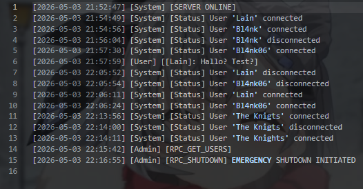

---

### **Kendala**

Tidak ada

---

### **Revisi**

#### **Menambahkan UI untuk The Knights agar mempermudah menjalankan fungsi**

* **Output UI**

	

#### **Menambahkan opsi get up time yang sebelumnya belum diimplementasikan**

* **Output get up time**

	

---

## **Penyelesaian Soal 2** 

### **Soal 2: The Battle of Eterion (IPC - Inter-Process Communication)**
*Tujuan: Mengelola komunikasi antar-proses lokal menggunakan memori bersama dan sinkronisasi.*

*   **Poin 1: Sinkronisasi Arena** – Menggunakan file header (`arena.h`) untuk mendefinisikan struktur data bersama dan mekanisme *shared memory* agar server (`orion`) dan client (`eternal`) bisa saling terhubung.
*   **Poin 2-3: Komunikasi IPC** – Membangun jalur pertukaran informasi menggunakan **Message Queue** (untuk perintah/pesan) dan **Shared Memory** (untuk data statis/real-time).
*   **Poin 4: Identitas & Persistensi** – Mengembangkan sistem Register dan Login dengan username unik. Data harus tetap tersimpan (*persistent*) di penyimpanan eksternal meskipun program dimatikan.
*   **Poin 5: Inisialisasi Karakter** – Menetapkan nilai awal (Health, Gold, XP, Level) bagi setiap prajurit baru yang masuk ke dunia Eterion.
*   **Poin 6: Matchmaking Logic** – Menciptakan sistem antrean pertempuran. Jika tidak menemukan lawan manusia dalam 35 detik, sistem otomatis akan memasangkan pemain dengan monster (bot).
*   **Poin 7: Real-time Battle System** – Mengimplementasikan pertarungan asinkron (bukan giliran). User menyerang dengan tombol "a" (cooldown 1 detik) atau "u" (Ultimate) sambil menampilkan log dan bar darah secara *real-time*.
*   **Poin 8: Progress System** – Menerapkan kalkulasi peningkatan XP, Level, dan Gold berdasarkan hasil akhir pertempuran (menang/kalah).
*   **Poin 9: Armory & Weaponry** – Membangun sistem gudang senjata untuk membeli perlengkapan. Sistem harus otomatis menggunakan senjata terkuat untuk meningkatkan damage dan mengaktifkan kemampuan Ultimate.
*   **Poin 10: Memory History** – Menyimpan dan menampilkan riwayat pertempuran setiap prajurit (log masa lalu) agar bisa diakses kapan saja.

---

### **Langkah Teknis**

```bash
# Pindah directory
cd soal2

# Membuat file header dan source code
touch arena.h orion.c eternal.c Makefile 

# Mengedit file
nano arena.h

nano orion.c

nano eternal.c

nano Makefile
```

---

### **Kode yang Digunakan**

#### **Kode yang digunakan dalam file arena.h** 

```c
// REPLACE TOTAL isi arena.h dengan ini:
#ifndef ARENA_H
#define ARENA_H

#include <stdio.h>
#include <stdlib.h>
#include <string.h>
#include <unistd.h>
#include <sys/ipc.h>
#include <sys/shm.h>
#include <sys/msg.h>
#include <sys/select.h>
#include <sys/time.h>
#include <pthread.h>
#include <termios.h>
#include <signal.h>
#include <errno.h>
#include <time.h>
#include <semaphore.h>

#define SHM_KEY 0x9988 
#define MSG_KEY 0x8899 
#define MAX_USERS 10

#define RESET "\033[0m"
#define RED   "\033[1;31m"
#define GREEN "\033[1;32m"
#define YEL   "\033[1;33m"
#define CYN   "\033[1;36m"
#define BOLD  "\033[1m"

typedef struct {
    char username[50];
    char password[50];
    int health;
    int money;
    int xp;
    int level;
    int has_weapon[6]; 
    int is_logged_in;
    int state; 
    int last_opponent_idx; 
    time_t queue_start;
    char history_log[10][100]; 
} User;

typedef struct {
    User users[MAX_USERS];
    sem_t mutex;
} SharedData;

struct msg_buffer {
    long msg_type;
    User user_data;
};

// Data Armory (ID 1-5 sesuai gambar)
static const char *arm_names[] = {"None", "Wooden Sword", "Iron Sword", "Steel Axe", "Demon Blade", "God Slayer"};
static const int arm_price[] = {0, 100, 300, 600, 1500, 5000};
static const int arm_dmg[] = {0, 5, 15, 30, 60, 150};

#endif
```

#### **Kode yang digunakan dalam file orion.c** 

```c
#include "arena.h"

SharedData *shm_ptr;

void save_db() {
    FILE *f = fopen("players.db", "wb");
    if (f) {
        fwrite(shm_ptr, sizeof(SharedData), 1, f);
        fclose(f);
    }
}

void load_db() {
    FILE *f = fopen("players.db", "rb");
    if (f) {
        fread(shm_ptr, sizeof(SharedData), 1, f);
        fclose(f);
        // Re-inisialisasi semaphore agar fresh setiap server nyala
        sem_init(&shm_ptr->mutex, 1, 1);
        // Reset status login dan state untuk semua user
        for (int i = 0; i < MAX_USERS; i++) {
            shm_ptr->users[i].is_logged_in = 0;
            shm_ptr->users[i].state = 0;
        }
        printf(YEL "[SYSTEM] Database dimuat dan status di-reset.\n" RESET);
    } else {
        memset(shm_ptr, 0, sizeof(SharedData));
        sem_init(&shm_ptr->mutex, 1, 1);
        printf(YEL "[SYSTEM] Database baru dibuat.\n" RESET);
    }
}

int main() {
    // Inisialisasi Shared Memory
    int shmid = shmget(SHM_KEY, sizeof(SharedData), IPC_CREAT | 0666);
    shm_ptr = (SharedData *)shmat(shmid, NULL, 0);
    if (shm_ptr == (void *)-1) { perror("shmat"); exit(1); }

    // Inisialisasi Message Queue
    int msgid = msgget(MSG_KEY, IPC_CREAT | 0666);

    load_db();

    printf(GREEN "[SERVER] Orion Arena berjalan...\n" RESET);

    while (1) {
        struct msg_buffer msg;
        
        // 1. Logika Registrasi (Non-blocking rcv)
        if (msgrcv(msgid, &msg, sizeof(User), 1, IPC_NOWAIT) != -1) {
            sem_wait(&shm_ptr->mutex);
            int slot = -1, exists = 0;
            for (int i = 0; i < MAX_USERS; i++) {
                if (strlen(shm_ptr->users[i].username) > 0 && 
                    strcmp(shm_ptr->users[i].username, msg.user_data.username) == 0) {
                    exists = 1;
                    break;
                }
                if (slot == -1 && strlen(shm_ptr->users[i].username) == 0) slot = i;
            }

            if (!exists && slot != -1) {
                strcpy(shm_ptr->users[slot].username, msg.user_data.username);
                strcpy(shm_ptr->users[slot].password, msg.user_data.password);
                shm_ptr->users[slot].money = 150; // Modal awal
                shm_ptr->users[slot].level = 1;
                shm_ptr->users[slot].xp = 0;
                shm_ptr->users[slot].health = 100;
                shm_ptr->users[slot].is_logged_in = 0;
                shm_ptr->users[slot].state = 0;
                
                save_db();
                msg.msg_type = msg.user_data.health; // Menggunakan field health sebagai tempat kirim PID
                msg.user_data.health = 100; // Penanda sukses
                printf(GREEN "[REGIS] User '%s' berhasil terdaftar.\n" RESET, msg.user_data.username);
            } else {
                msg.msg_type = msg.user_data.health; 
                msg.user_data.health = -1; // Penanda gagal
                printf(RED "[REGIS] Pendaftaran '%s' gagal (Penuh/Duplikat).\n" RESET, msg.user_data.username);
            }
            sem_post(&shm_ptr->mutex);
            msgsnd(msgid, &msg, sizeof(User), 0);
        }

        // 2. Logika Matchmaking (PVP & PVE Bot)
        time_t now = time(NULL);
        for (int i = 0; i < MAX_USERS; i++) {
            if (shm_ptr->users[i].state == 1) { // User sedang antre
                int found_opponent = 0;

                // Cek Lawan Manusia
                for (int j = i + 1; j < MAX_USERS; j++) {
                    if (shm_ptr->users[j].state == 1) {
                        sem_wait(&shm_ptr->mutex);
                        shm_ptr->users[i].state = 2;
                        shm_ptr->users[j].state = 2;
                        shm_ptr->users[i].last_opponent_idx = j;
                        shm_ptr->users[j].last_opponent_idx = i;
                        sem_post(&shm_ptr->mutex);
                        
                        printf(GREEN "[BATTLE] %s VS %s DIMULAI!\n" RESET, 
                               shm_ptr->users[i].username, shm_ptr->users[j].username);
                        found_opponent = 1;
                        break;
                    }
                }

                // Cek Timer untuk VS Bot (35 detik)
                if (!found_opponent && (now - shm_ptr->users[i].queue_start >= 35)) {
                    sem_wait(&shm_ptr->mutex);
                    shm_ptr->users[i].state = 2;
                    shm_ptr->users[i].last_opponent_idx = -2; // Kode VS Bot
                    sem_post(&shm_ptr->mutex);
                    
                    printf(YEL "[PVE] %s VS Wild Beast dimulai (Timeout 35s)!\n" RESET, 
                           shm_ptr->users[i].username);
                }
            }
        }
        
        // Auto-save berkala setiap loop
        save_db();
        usleep(500000); // 0.5 detik loop rate untuk hemat CPU
    }

    shmdt(shm_ptr);
    return 0;
}
```

#### **Kode yang digunakan dalam file eternal.c** 

```c
#include "arena.h"

// --- GLOBAL VARIABLES ---
int current_idx = -1;
SharedData *shm_ptr;
struct termios oldt;
int is_raw = 0;

// --- FUNCTION PROTOTYPES ---
// Menghindari warning "implicit declaration"
void user_game_menu();
void battle_ui();
void matchmaking_menu();
void armory_menu();
void print_header();
void draw_line(int n);
void set_raw_mode(int enable);
void wait_for_enter();
void handle_sigint(int sig);

// --- UTILITY SYSTEM ---

void draw_line(int n) {
    for(int i=0; i<n; i++) printf("-");
    printf("\n");
}

void set_raw_mode(int enable) {
    if (enable && !is_raw) {
        struct termios newt;
        tcgetattr(STDIN_FILENO, &oldt);
        newt = oldt;
        newt.c_lflag &= ~(ICANON | ECHO);
        tcsetattr(STDIN_FILENO, TCSANOW, &newt);
        is_raw = 1;
    } else if (!enable && is_raw) {
        tcsetattr(STDIN_FILENO, TCSANOW, &oldt);
        is_raw = 0;
    }
}

void wait_for_enter() {
    printf("\nTekan Enter untuk melanjutkan...");
    fflush(stdout);
    if (is_raw) {
        getchar();
    } else {
        // Buffer clearing untuk mode standar
        int c;
        while ((c = getchar()) != '\n' && c != EOF);
    }
}

void handle_sigint(int sig) {
    set_raw_mode(0);
    if(current_idx != -1) {
        sem_wait(&shm_ptr->mutex);
        shm_ptr->users[current_idx].is_logged_in = 0;
        sem_post(&shm_ptr->mutex);
    }
    printf("\n" YEL "[SYSTEM] Logout aman. Terminal di-reset." RESET "\n");
    exit(0);
}

// --- VISUAL & STATS SYSTEM ---

void print_header() {
    printf(CYN BOLD);
    printf("| __ )  / \\|_   _|_   _| |   | ____|   / _ \\|  ___|\n");
    printf("|  _ \\ / _ \\ | |   | | | |   |  _|    | | | | |_   \n");
    printf("| |_) / ___ \\| |   | | | |___| |___   | |_| |  _|  \n");
    printf("|____/_/   \\_\\_|   |_| |_____|_____|   \\___/|_|    \n");
    printf("| ____|_   _| ____|  _ \\|_ _/ _ \\| \\ | |\n");
    printf("|  _|   | | |  _| | |_) || | | | |  \\| |\n");
    printf("| |___  | | | |___|  _ < | | |_| | |\\  |\n");
    printf("|_____| |_| |_____|_| \\_\\___\\___/|_| \\_|\n" RESET);
}

void draw_health_bar(int current, int max) {
    int bar_len = 20;
    if (max <= 0) max = 1;
    float ratio = (float)current / max;
    int filled = (int)(ratio * bar_len);
    if (filled < 0) filled = 0;
    if (filled > bar_len) filled = bar_len;

    printf("[");
    for(int i=0; i<bar_len; i++) {
        if(i < filled) printf(GREEN "█" RESET);
        else printf(" ");
    }
    printf("] %d/%d HP\n", (current < 0 ? 0 : current), max);
}

int get_max_hp(User *u) { return 100 + (u->xp / 10); }

int get_total_dmg(User *u) {
    int w_dmg = 0;
    // Mencari senjata terkuat yang dimiliki (menggunakan data dari arena.h)
    for(int i=5; i>=1; i--) {
        if(u->has_weapon[i]) {
            w_dmg = arm_dmg[i];
            break;
        }
    }
    return 5 + (u->xp / 50) + w_dmg;
}

void add_history(char *opp_name, char *res, int xp, int gold) {
    time_t t = time(NULL);
    struct tm tm = *localtime(&t);
    char entry[100];
    sprintf(entry, "%02d:%02d | %-12s | %-7s | +%d XP | +%d G", 
            tm.tm_hour, tm.tm_min, opp_name, res, xp, gold);
    
    sem_wait(&shm_ptr->mutex);
    for(int i=9; i>0; i--) {
        strcpy(shm_ptr->users[current_idx].history_log[i], shm_ptr->users[current_idx].history_log[i-1]);
    }
    strcpy(shm_ptr->users[current_idx].history_log[0], entry);
    sem_post(&shm_ptr->mutex);
}

// --- GAMEPLAY MENUS ---

void armory_menu() {
    while(1) {
        system("clear");
        print_header();
        sem_wait(&shm_ptr->mutex);
        User *me = &shm_ptr->users[current_idx];
        printf("\n=== ARMORY SHOP === (Gold: %d)\n", me->money);
        for(int i=1; i<=5; i++) {
            printf("%d. %-15s | %4dG | +%3d Dmg %s\n", 
                   i, arm_names[i], arm_price[i], arm_dmg[i], 
                   me->has_weapon[i] ? GREEN "(OWNED)" RESET : "");
        }
        sem_post(&shm_ptr->mutex);
        
        printf("0. Kembali\nPilihan: ");
        int c; 
        if (scanf("%d", &c) != 1) { while(getchar() != '\n'); continue; }
        
        if(c == 0) break;
        if(c >= 1 && c <= 5) {
            sem_wait(&shm_ptr->mutex);
            if(me->has_weapon[c]) {
                printf(YEL "\nAnda sudah memiliki item ini!\n" RESET);
            } else if(me->money < arm_price[c]) {
                printf(RED "\nGold tidak mencukupi!\n" RESET);
            } else {
                me->money -= arm_price[c];
                me->has_weapon[c] = 1;
                printf(GREEN "\nBerhasil membeli %s!\n" RESET, arm_names[c]);
            }
            sem_post(&shm_ptr->mutex);
            sleep(1);
        }
    }
}

void battle_ui() {
    set_raw_mode(1);
    char logs[5][100] = {"", "", "", "", "Pertarungan Dimulai!"};
    User *me = &shm_ptr->users[current_idx];
    
    // Bot data
    User bot; 
    strcpy(bot.username, "Wild Beast"); 
    bot.health = 100; bot.level = 1; bot.xp = 0;

    while(me->state == 2) {
        system("clear");
        User *opp = (me->last_opponent_idx == -2) ? &bot : &shm_ptr->users[me->last_opponent_idx];
        
        printf(RED BOLD "%-15s" RESET " LVL:%d\n", opp->username, opp->level);
        draw_health_bar(opp->health, (me->last_opponent_idx == -2) ? 100 : get_max_hp(opp));
        
        printf("\n          " YEL "VS" RESET "          \n\n");
        
        printf(GREEN BOLD "%-15s" RESET " LVL:%d\n", me->username, me->level);
        draw_health_bar(me->health, get_max_hp(me));

        printf("\nCOMBAT LOG:\n");
        for(int i=0; i<5; i++) printf("> %s\n", logs[i]);
        printf("\n" BOLD "[a] Attack | [u] Ultimate (x3) | [q] Kabur" RESET "\nChoice: ");
        
        char c = getchar();
        if(c == 'q') {
            sem_wait(&shm_ptr->mutex);
            me->state = 0;
            sem_post(&shm_ptr->mutex);
            add_history(opp->username, "RUN", 15, 30);
            break;
        }

        if(c == 'a' || c == 'u') {
            sem_wait(&shm_ptr->mutex);
            int d = get_total_dmg(me);
            if(c == 'u') d *= 3;
            opp->health -= d;
            
            for(int i=0; i<4; i++) strcpy(logs[i], logs[i+1]);
            sprintf(logs[4], "Kamu hit %s sebesar %d dmg!", opp->username, d);

            if(opp->health > 0) {
                int od = (me->last_opponent_idx == -2) ? 8 : get_total_dmg(opp);
                me->health -= od;
                for(int i=0; i<4; i++) strcpy(logs[i], logs[i+1]);
                sprintf(logs[4], "%s membalas %d dmg!", opp->username, od);
            }
            sem_post(&shm_ptr->mutex);
        }

        if(opp->health <= 0 || me->health <= 0) {
            set_raw_mode(0);
            system("clear");
            sem_wait(&shm_ptr->mutex);
            int rxp, rgold;
            char *status;
            if(opp->health <= 0) {
                printf(GREEN BOLD "=== VICTORY ===\n" RESET);
                rxp = 50; rgold = 120; status = "WIN";
            } else {
                printf(RED BOLD "=== DEFEAT ===\n" RESET);
                rxp = 15; rgold = 30; status = "LOSS";
            }
            me->xp += rxp; me->money += rgold;
            me->level = 1 + (me->xp / 100);
            me->state = 0;
            me->health = get_max_hp(me);
            sem_post(&shm_ptr->mutex);
            
            add_history(opp->username, status, rxp, rgold);
            printf("Reward: +%d XP | +%d Gold\n", rxp, rgold);
            wait_for_enter();
            break;
        }
        usleep(50000);
    }
    set_raw_mode(0);
}

void matchmaking_menu() {
    sem_wait(&shm_ptr->mutex);
    shm_ptr->users[current_idx].state = 1;
    shm_ptr->users[current_idx].queue_start = time(NULL);
    sem_post(&shm_ptr->mutex);

    set_raw_mode(1);
    while(1) {
        system("clear");
        print_header();
        int elapsed = time(NULL) - shm_ptr->users[current_idx].queue_start;
        
        printf("\n" YEL "Mencari lawan... [%ds / 35s]" RESET "\n", elapsed);
        printf("Tekan [q] untuk membatalkan antrean\n");

        if(shm_ptr->users[current_idx].state == 2) { 
            set_raw_mode(0); 
            battle_ui(); 
            break; 
        }
        
        // Non-blocking key check
        struct timeval tv = {0, 500000}; 
        fd_set fds; FD_ZERO(&fds); FD_SET(STDIN_FILENO, &fds);
        if(select(STDIN_FILENO+1, &fds, NULL, NULL, &tv) > 0) {
            if(getchar() == 'q') {
                sem_wait(&shm_ptr->mutex); 
                shm_ptr->users[current_idx].state = 0; 
                sem_post(&shm_ptr->mutex);
                break;
            }
        }
    }
    set_raw_mode(0);
}

void user_game_menu() {
    while(1) {
        system("clear");
        print_header();
        sem_wait(&shm_ptr->mutex);
        User *me = &shm_ptr->users[current_idx];
        printf("\n" BOLD "=== PLAYER PROFILE ===" RESET "\n");
        printf("Username : %-15s | Level : %d\n", me->username, me->level);
        printf("Gold     : %-15d | XP    : %d/100\n", me->money, me->xp % 100);
        printf("HP       : %d/%d\n", me->health, get_max_hp(me));
        sem_post(&shm_ptr->mutex);

        printf("\n1. Battle Arena\n2. Armory Shop\n3. Match History\n4. Logout\nPilihan: ");
        int c; 
        if (scanf("%d", &c) != 1) { while(getchar() != '\n'); continue; }

        if(c == 1) matchmaking_menu();
        else if(c == 2) armory_menu();
        else if(c == 3) {
            system("clear");
            printf(BOLD "=== MATCH HISTORY ===\n" RESET);
            draw_line(55);
            sem_wait(&shm_ptr->mutex);
            for(int i=0; i<10; i++) {
                if(strlen(me->history_log[i]) > 0) printf("%s\n", me->history_log[i]);
            }
            sem_post(&shm_ptr->mutex);
            wait_for_enter();
        }
        else if(c == 4) {
            sem_wait(&shm_ptr->mutex);
            shm_ptr->users[current_idx].is_logged_in = 0;
            sem_post(&shm_ptr->mutex);
            break;
        }
    }
}

// --- MAIN SYSTEM ---

int main() {
    // Shared Memory Setup
    int shmid = shmget(SHM_KEY, sizeof(SharedData), 0666);
    if(shmid == -1) { printf(RED "Error: Jalankan ./orion terlebih dahulu!\n" RESET); exit(1); }
    shm_ptr = (SharedData *)shmat(shmid, NULL, 0);
    int msgid = msgget(MSG_KEY, 0666);

    signal(SIGINT, handle_sigint);

    while(1) {
        system("clear");
        print_header();
        printf("\n1. Register\n2. Login\n3. Exit\nPilihan: ");
        int choice;
        if (scanf("%d", &choice) != 1) { while(getchar() != '\n'); continue; }

        if(choice == 3) break;

        if(choice == 1) {
            struct msg_buffer m;
            m.msg_type = 1;
            m.user_data.health = getpid(); // Identifikasi PID
            printf("Username Baru: "); scanf("%s", m.user_data.username);
            printf("Password Baru: "); scanf("%s", m.user_data.password);
            msgsnd(msgid, &m, sizeof(User), 0);
            
            // Tunggu feedback
            msgrcv(msgid, &m, sizeof(User), getpid(), 0);
            if(m.user_data.health != -1) printf(GREEN "Registrasi Berhasil!\n" RESET);
            else printf(RED "Registrasi Gagal (Username duplikat/Server penuh).\n" RESET);
            sleep(2);
        } else if(choice == 2) {
            char u[50], p[50];
            printf("Username: "); scanf("%s", u);
            printf("Password: "); scanf("%s", p);
            
            int found = -1;
            sem_wait(&shm_ptr->mutex);
            for(int i=0; i<MAX_USERS; i++) {
                if(strlen(shm_ptr->users[i].username) > 0 && 
                   strcmp(shm_ptr->users[i].username, u) == 0 && 
                   strcmp(shm_ptr->users[i].password, p) == 0) {
                    if(shm_ptr->users[i].is_logged_in) found = -2;
                    else {
                        shm_ptr->users[i].is_logged_in = 1;
                        current_idx = i;
                        found = i;
                    }
                    break;
                }
            }
            sem_post(&shm_ptr->mutex);

            if(found >= 0) {
                printf(GREEN "Login Berhasil!\n" RESET);
                sleep(1);
                user_game_menu();
            }
            else if(found == -2) { printf(RED "Akun sudah login!\n" RESET); sleep(2); }
            else { printf(RED "Login Gagal!\n" RESET); sleep(2); }
        }
    }
    shmdt(shm_ptr);
    return 0;
}
```

#### **Kode yang digunakan dalam file Makefile** 

```make
all: orion eternal

orion: orion.c arena.h
	gcc orion.c -o orion -lpthread

eternal: eternal.c arena.h
	gcc eternal.c -o eternal -lpthread

# Membersihkan Shared Memory dan Message Queue berdasarkan Key di arena.h
clear_ipc:
	ipcrm -M 0x9988 || true
	ipcrm -Q 0x8899 || true
	rm -f players.db
	@echo "IPC Cleared and Database Deleted."

clean:
	rm -f orion eternal players.db
	@echo "Binaries and Database cleaned."
```

---

### **Penjelasan**

#### **1. Sinkronisasi Arena & Komunikasi IPC (Poin 1-3)**
Sistem menggunakan `arena.h` sebagai kontrak antara `orion` dan `eternal`. Komunikasi dibangun menggunakan **Shared Memory** untuk data yang bersifat masif dan *real-time* (seperti posisi HP dan status pemain), serta **Message Queue** untuk pengiriman pesan registrasi dan login yang bersifat satu arah.

#### **2. Identitas & Persistensi (Poin 4-5)**
Registrasi memastikan *username* bersifat unik. Data pemain disimpan ke dalam file biner (misal: `players.db`) oleh `orion.c`. Ketika program dimatikan dan dinyalakan kembali, fungsi `load_db()` akan membaca file tersebut sehingga nilai *Health*, *Gold*, dan *Level* pemain tetap konsisten.

#### **3. Matchmaking & Real-time Battle (Poin 6-7)**
`orion.c` memantau antrean pemain di Shared Memory. Jika pemain menunggu lebih dari 35 detik, server akan mengubah status pemain untuk melawan *Bot*. Pertempuran berjalan secara asinkron menggunakan *looping* cepat; serangan dibatasi oleh variabel `last_attack_time` untuk memastikan *cooldown* 1 detik terpenuhi.

#### **4. Progress, Armory, & History (Poin 8-10)**
Setelah pertempuran, `orion` menghitung perolehan Gold dan XP. Di *Armory*, pemain bisa membeli senjata yang akan meningkatkan `damage`. Setiap hasil akhir pertandingan ditulis ke dalam array `history_log` di Shared Memory agar bisa ditampilkan kembali pada menu *History*.

---

### **Cara Menggunakan**

#### **1. Compile** 

```bash
# Melakukan kompilasi otomatis untuk orion dan eternal
make

# Jika ingin mereset Shared Memory yang error/nyangkut
make clear_ipc
```

#### **2. Menjalankan Permainan**

##### **A. Menjalankan Server Orion**
Buka terminal pertama dan jalankan server sebagai pengelola arena:
```bash
./orion
```
*Server akan memuat database pemain dan standby menerima koneksi.*

##### **B. Menjalankan Client Eternal**
Buka terminal kedua (atau lebih) untuk bermain:
```bash
./eternal
```
1.  **Register/Login:** Masukkan akun baru atau akun yang sudah ada.
2.  **Menu Utama:** Pilih **Battle** untuk mencari lawan.
3.  **Battle:** Tekan **'a'** untuk menyerang atau **'u'** untuk Ultimate (jika punya senjata).
4.  **Shop/Armory:** Gunakan Gold dari hasil menang untuk membeli senjata.
5.  **History:** Lihat catatan kemenangan/kekalahanmu sebelumnya.

---

### **Output**

#### **1. Inisialisasi Arena & Persistence (Poin 1, 4, & 5)**
*   **Screenshot Menjalankan Server:** Tampilkan terminal saat `./orion` dijalankan. Pastikan muncul pesan bahwa server telah memuat database pemain (misal: `Loaded 5 players from database`).

	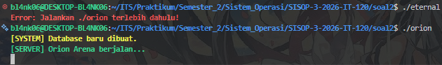

*   **Screenshot Register/Login:** Tunjukkan terminal `eternal` saat membuat karakter baru dan mendapatkan status awal (HP 100, Gold 0, XP 0).

	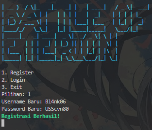

	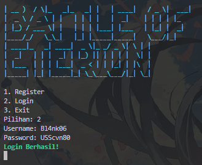

	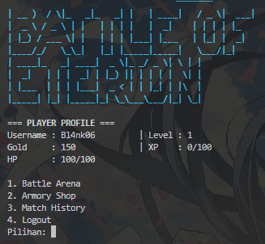

*   **Screenshot File Database:** Tampilkan hasil perintah `ls -l` di terminal untuk menunjukkan adanya file `players.db` sebagai bukti data tersimpan di penyimpanan eksternal.

	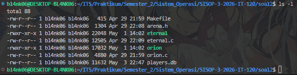

	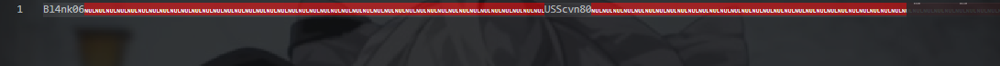

#### **2. Matchmaking Logic (Poin 6)**
*   **Screenshot Antrean (Queue):** Tampilkan terminal `eternal` yang sedang dalam status `Searching for opponent...`.

	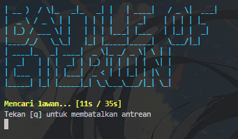

*   **Screenshot Matchmaking Bot:** Jika tidak ada lawan dalam 35 detik, ambil screenshot saat sistem memunculkan pesan `No human opponent found. A wild Monster appeared!` sebagai bukti logika *timer* berjalan.

	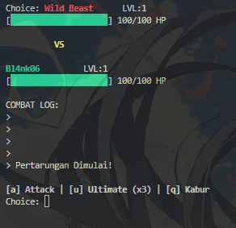

#### **3. Real-time Battle System**
*   **Screenshot Battle UI:** Tampilkan terminal saat pertarungan sedang berlangsung.

	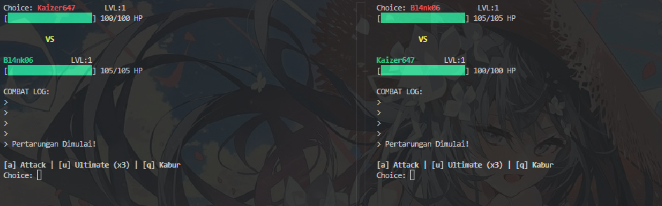

#### **4. Progress & Armory (Poin 8 & 9)**
*   **Screenshot Hasil Pertempuran:** Tampilkan layar setelah menang/kalah yang menunjukkan penambahan **XP** dan **Gold**.

	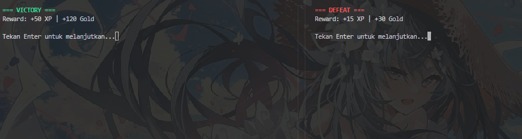

*   **Screenshot Toko Senjata (Shop):** Tunjukkan terminal saat membeli senjata baru di menu *Armory*.

	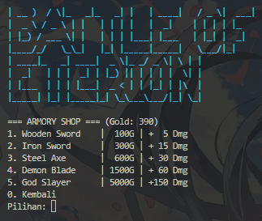

	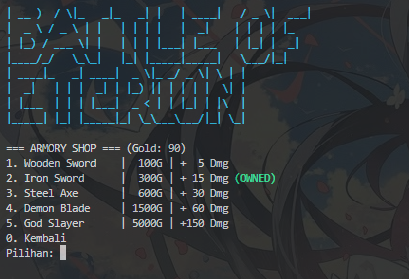

*   **Screenshot Damage Increase:** Tunjukkan perbedaan *damage* yang dihasilkan sebelum dan sesudah membeli senjata.

	Sebelum

	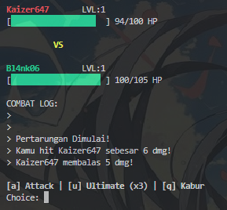

	Sesudah

	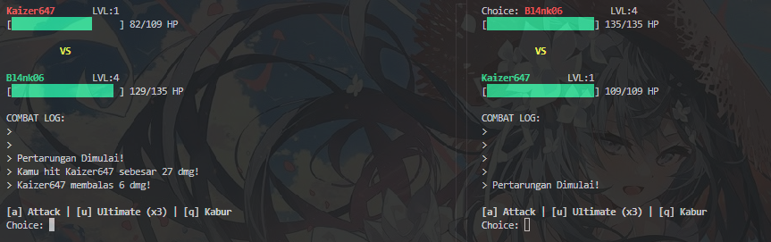

	Ultimate

	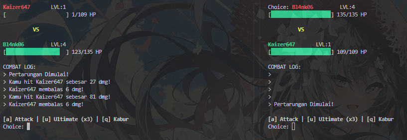

#### **5. IPC Cleanup (Poin 10)**
*   **Screenshot Clean IPC (Makefile):** Tunjukkan hasil dari perintah `make clear_ipc` di terminal untuk membuktikan bahwa bisa membersihkan *Shared Memory* dan *Message Queue* secara manual.

	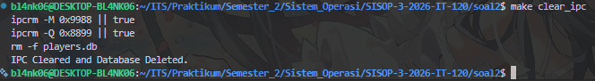

---

### **Kendala**

* Saat awal-awal membuat dan menjalankan kode, mengalami kegagalan pada registrasi akun baru meskipun belum ada akun dalam player.db
* Opsi history gagal dijalankan
* Saat kedua belah pihak menyerang bersamaan, sering muncul kasus di mana kedua belah pihak kalah
* Munculnya opsi penggunaan ultimate dan dapat menggunakan ultimate sebelum player memiliki senjata
* HP setelah battle tidak direset ke angka maks
* HP bisa lebih rendah dari 0
* HP yang terdapat di terminal lain tidak saling sinkron

---

### **Revisi**

#### **Menambahkan cooldown atk 1s untuk mengatasi spam**

* **Output ...**

	

#### **Menambahkan informasi nama senjata yg dipakai saat battle**

* **Output ...**

	

#### **Memperbaiki error pada fungsi history**

* **Output ...**

	

#### **Memperbaiki error handling saat kedua belah pihak kalah bersamaan**

* **Output ...**

	

#### **Memperbaiki logika ultimate jika player belum memiliki senjata**

* **Output ...**

	

#### **Memperbaiki logika HP agar setelah battle kembali ke angka maks, tidak lebih rendah dari 0, dan saling sinkron**

* **Output ...**

	

---